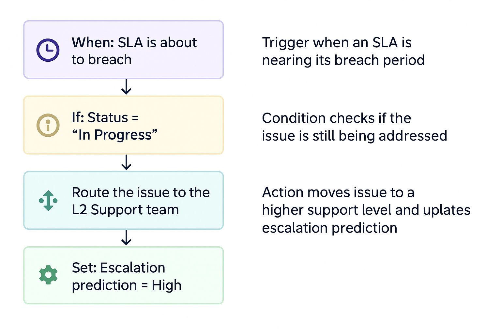
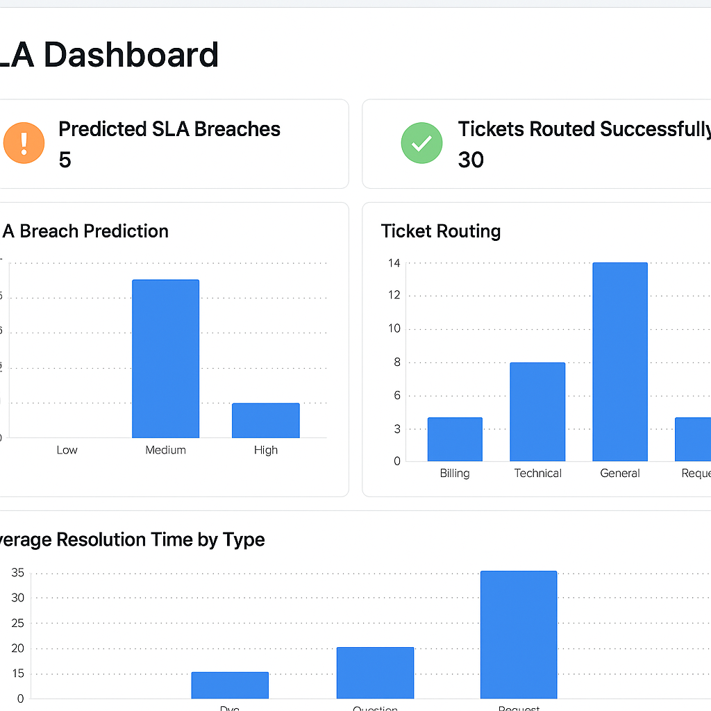
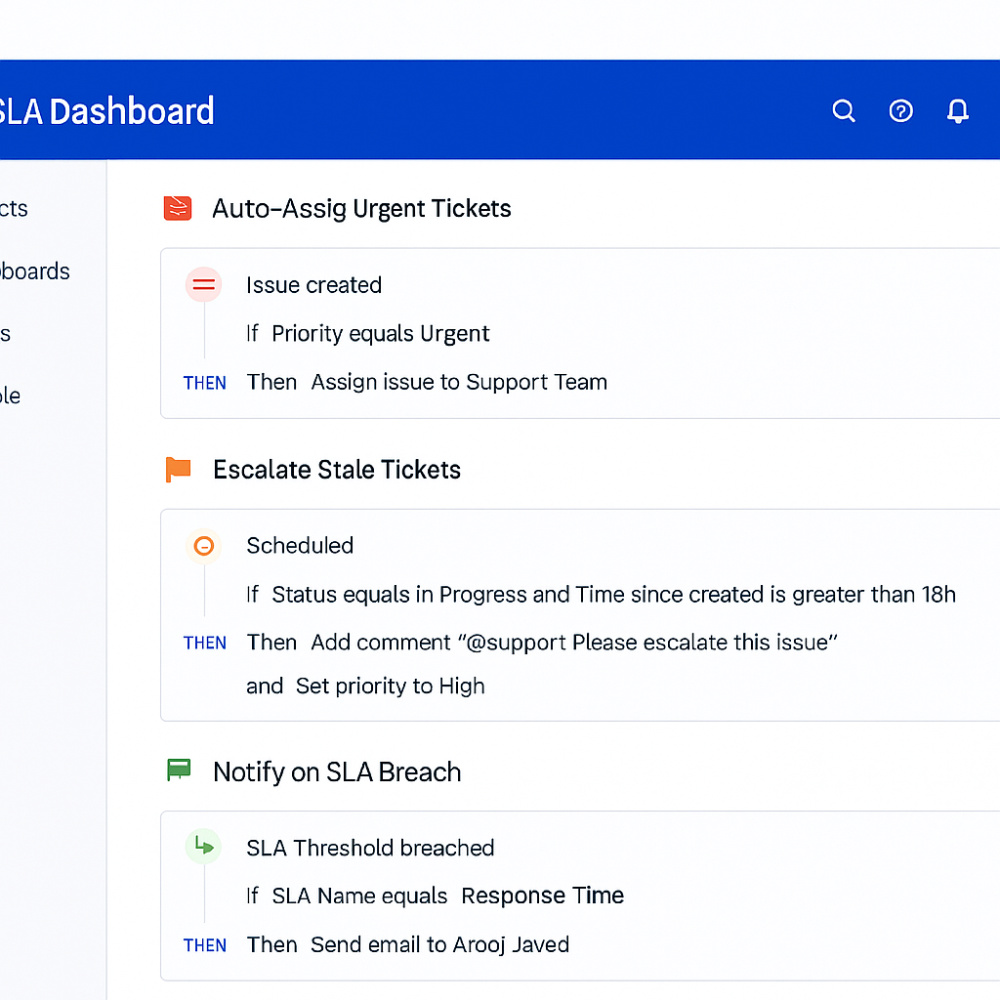
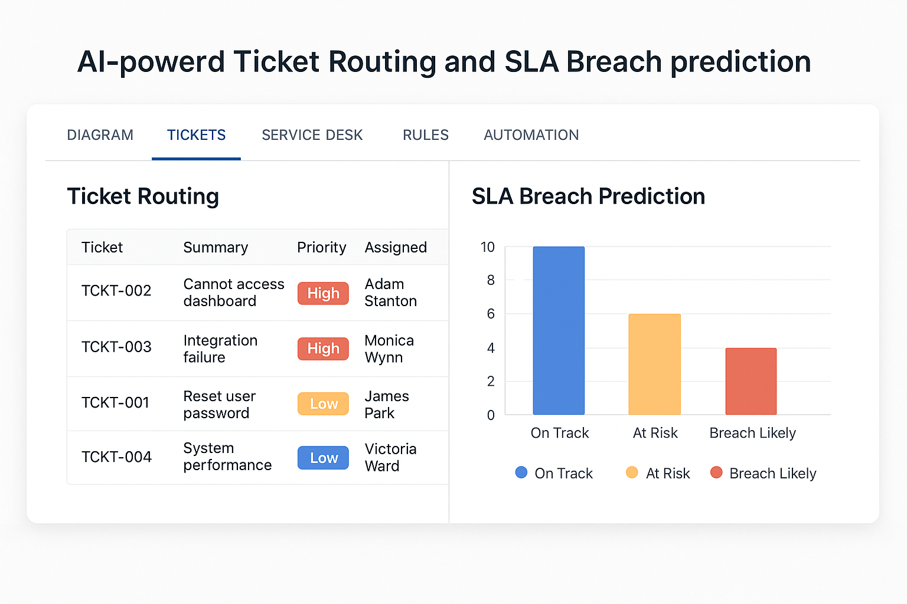

# 🧠 AI-Powered Ticket Routing & SLA Breach Prediction in JIRA

[](LICENSE)
[](https://www.python.org/)
[](#author)


🔮 **Revolutionize your support operations using AI-based automation in JIRA**  
🚀 Boost SLA compliance. 📊 Automate ticket classification. ⚙️ Predict resolution delays, all with Python and machine learning.

---

## 🌟 Overview

Modern technical support teams often struggle with manual ticket routing, backlog prioritization, and SLA breaches. This project delivers a complete solution using AI and data-driven automation built into the JIRA environment.

Whether you're managing a support team or optimizing ITSM workflows, this toolset helps reduce time-to-resolution, prevent SLA violations, and enhance team productivity.

---

## 💡 Key Features

- ✅ **Automated Ticket Classification:** Classify new JIRA issues by category (e.g., Bug, Feature, Incident) using natural language processing (NLP).
- ⏱ **SLA Breach Prediction:** Predict whether an open issue is at risk of missing its SLA based on historical ticket patterns.
- 📤 **Auto-routing Logic:** Assign issues to the most appropriate support group based on AI tagging and JIRA custom fields.
- 📈 **Interactive Dashboards:** Visualize ticket risk levels, SLA trends, and issue heatmaps via reporting dashboards.
- 🔌 **API Integration Ready:** Easily integrate the solution into existing JIRA workflows and CI/CD pipelines.

---

## 📁 Project Structure

```bash
├── /data/                → Sample datasets & JIRA export files
├── /models/              → Pre-trained classification & prediction models
├── /notebooks/           → Jupyter notebooks for training & evaluation
├── /scripts/             → Python scripts to trigger classification/prediction
├── /api/                 → Flask-based RESTful API for automation
├── /screenshots/         → Sample outputs and workflow screenshots
└── README.md             → Project documentation

---

## 📁 Folder Structure

```
├── api/                        # Flask app with endpoints
├── automation-rules/          # JSON rules for JIRA
├── dummy-data/                # Sample ticket datasets
├── screenshots/               # Visuals of workflows and dashboards
├── README.md                  # This file
└── requirements.txt           # Python dependencies
```

---

## 🚀 Getting Started

1. Clone the repo  
```bash
git clone https://github.com/your-username/jira-ai-sla-automation.git
cd jira-ai-sla-automation
```

2. Create virtual environment  
```bash
python -m venv venv
source venv/bin/activate  # or venv\Scripts\activate on Windows
```

3. Install dependencies  
```bash
pip install -r requirements.txt
```

4. Run the Flask server  
```bash
python api/app.py
```

---

## 📊 Workflow Overview

### 🔁 Automation Flowchart


### 🧠 SLA Dashboard Preview


### ⚙️ Sample Automation Workflow


### 🚀 Ticket Routing Visual


---

## 📚 Use Cases

This solution is ideal for:
	•	IT Support Teams managing SLA-heavy environments
	•	Product Support Units handling large ticket volumes
	•	DevOps teams seeking intelligent triage and automation
	•	Startups and Enterprises using Atlassian JIRA for support workflows

⸻

🧠 Tech Stack
	•	Python: Core scripting and model orchestration
	•	Scikit-learn / XGBoost: Model training and tuning
	•	NLTK / spaCy: Text preprocessing and tokenization
	•	Flask: Lightweight REST API for integration
	•	Pandas / Matplotlib / Seaborn: Reporting and analytics
	•	JIRA REST API: For ticket access and updates

---

## 📌 Author

**Arooj Javed**  
Support Engineer | Workflow Automator | Python + JIRA Enthusiast  
GitHub: [@aroojjaved93](https://github.com/aroojJaved93)

---

## 📄 License

This project is licensed under the MIT License.

---

## 🌍 Contributions & Feedback

Stars, forks, and contributions are highly welcome!  
Feel free to create issues or pull requests to suggest improvements.
